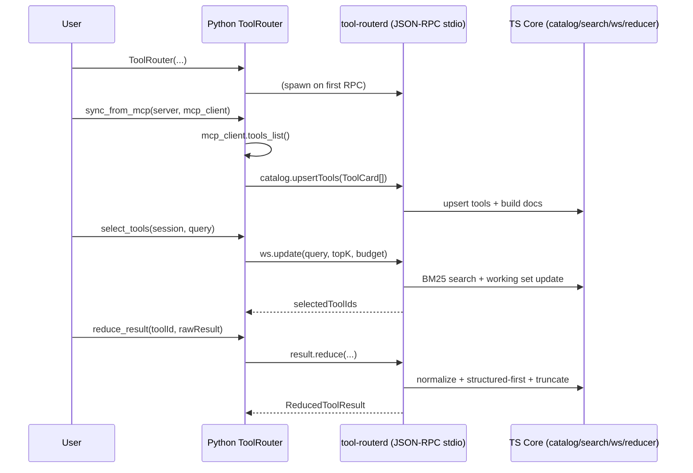

# MCP Tool Router

A TypeScript core + Python wrapper toolkit for routing Model Context Protocol (MCP) tools with
BM25 search, working-set management, and deterministic result reduction.

## Goals

- Fast tool search (BM25) with field weighting and post-score rules
- Tool definition token budgeting within a per-turn budget
- Working-set plug/unplug to stabilize multi-turn tool exposure
- Deterministic tool-result reducers for long/noisy outputs
- MCP-friendly integration: `tools/list` -> index -> expose only needed tools

## Non-goals (initial scope)

- The TS core does not call LLM providers directly
- No embedding or hybrid vector search (BM25 first)
- The TS core does not manage MCP server connections (Python does)

## Architecture

- **TypeScript core**: catalog, BM25, working set, result policy, safety hints
- **Router daemon**: `tool-routerd` JSON-RPC over stdio (optional HTTP)
- **Python wrapper**: MCP sync, LLM orchestration, daemon lifecycle


## Quickstart

```bash
python examples/quickstart.py
```

Set `ROUTERD` to override the daemon command, for example:

```bash
ROUTERD="tool-routerd" python examples/quickstart.py
```

## Sequence diagram


## Repository layout

```
packages/
  core/      # BM25, tokenizer, working set, result policy
  daemon/    # tool-routerd JSON-RPC server
  cli/       # catalog build/search/eval tooling
  shared/    # shared types and utilities
python/
  mcp_tool_router/  # Python client wrapper
  pyproject.toml
examples/
```


## License

MIT
