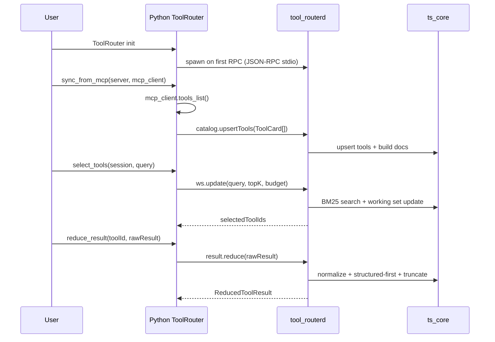

# MCP Tool Router

A TypeScript core + Python wrapper toolkit for routing Model Context Protocol (MCP) tools with
BM25 search, working-set management, and deterministic result reduction.

## Goals

- Fast tool search (BM25) with field weighting and post-score rules
- Tool definition token budgeting within a per-turn budget
- Working-set plug/unplug to stabilize multi-turn tool exposure
- Deterministic tool-result reducers for long/noisy outputs
- MCP-friendly integration: `tools/list` -> index -> expose only needed tools

## Non-goals (initial scope)

- The TS core does not call LLM providers directly
- No embedding or hybrid vector search (BM25 first)
- The TS core does not manage MCP server connections (Python does)

## Minimum MCP tool fields

To keep external MCP integrations low-friction, the router only requires MCP-standard fields:

- `name`
- `description` (optional but recommended)
- `inputSchema` (or `input_schema`)

Everything else is optional. If `tags`/`synonyms`/`examples`/`authHint` are missing,
the Python sync layer derives lightweight `tags` and `synonyms` from `name`/`title`/`description`
so lexical search remains effective.

## Architecture

- **TypeScript core**: catalog, BM25, working set, result policy, safety hints
- **Router daemon**: `tool-routerd` JSON-RPC over stdio (local IPC)
- **Python wrapper**: MCP sync, LLM orchestration, daemon lifecycle


## Quickstart

First, install Node dependencies and build the TypeScript packages:

```bash
npm install
npm run build
```

Then run the Python example (requires a real MCP stdio server):

```bash
python examples/quickstart.py
```

```bash
MCP_SERVER_CMD="your-mcp-server --stdio" python examples/quickstart.py
```

Set `ROUTERD` to override the daemon command, for example:

```bash
ROUTERD="tool-routerd" python examples/quickstart.py
```

## MCP server registry + hub

Register many MCP servers in a single YAML file, then sync/route/call through a hub.

Example registry (`examples/mcp-servers.yaml`):

```yaml
servers:
  - id: slack
    cmd: "npx @modelcontextprotocol/server-slack --stdio"
    enabled: true
  - id: github
    cmd: "npx @modelcontextprotocol/server-github --stdio"
    enabled: true
```

Usage:

```python
from mcp_tool_router import ToolRouterHub

hub = ToolRouterHub.from_yaml("examples/mcp-servers.yaml")
hub.sync_all()
tool_ids = hub.select_tools("session-1", "summarize the latest report")
result = hub.call_tool(tool_ids[0], {"query": "latest report"})
```

Notes:
- Only `stdio` transport is supported for MCP servers.
- `init` payloads are supported in YAML; set `initialized: true` to send the notification after `initialize`.

### Use OpenCode config as registry

If you already manage MCP servers in OpenCode, you can load them directly:

```python
from mcp_tool_router import ToolRouterHub

hub = ToolRouterHub.from_opencode_config("~/.config/opencode/opencode.json")
hub.sync_all()
tool_ids = hub.select_tools("session-1", "summarize the latest report")
```

## Run the router as an MCP server (OpenCode)

If you want OpenCode to connect to a single MCP server (the router) while still
using your existing MCP servers, run the router MCP server and let it read the
OpenCode config directly.

Recommended flow:

1. Keep your existing MCP servers in `~/.config/opencode/opencode.json`, but set
   them to `enabled: false` so OpenCode does not connect to them directly.
2. Add one MCP entry for the router that launches this repo.

Example OpenCode config snippet:

```json
{
  "mcp": {
    "router": {
      "type": "local",
      "enabled": true,
      "command": ["python3", "-m", "mcp_tool_router.router_mcp_server"]
    },
    "slack": {
      "type": "local",
      "enabled": false,
      "command": ["node", "/path/to/slack-mcp/server.js"]
    }
  }
}
```

The router MCP server exposes two tools:

- `router_select_tools`: select relevant tool IDs for a query (returns tool defs)
- `router_call_tool`: call a tool by `{serverId}:{toolName}`

Environment variables:

- `OPENCODE_CONFIG`: path to OpenCode config (default: `~/.config/opencode/opencode.json`)
- `ROUTERD`: override the router daemon command
- `ROUTER_IGNORE_IDS`: comma-separated MCP server IDs to ignore
- `ROUTER_INCLUDE_DISABLED`: set to `false` to skip disabled entries

This keeps the MCP tool list tiny inside OpenCode while the router dynamically
selects tools and proxies calls to the underlying servers.

## Compare against a real MCP server

Provide a real MCP stdio server and compare naive vs router selection:

```bash
MCP_SERVER_CMD="your-mcp-server --stdio" python examples/compare_mcp.py "summarize the latest report"
```

If your MCP server requires initialization, pass the JSON payload and (optionally) the initialized notification:

```bash
MCP_INIT='{"protocolVersion":"...","capabilities":{}}' MCP_INITIALIZED=1 \
  MCP_SERVER_CMD="your-mcp-server --stdio" python examples/compare_mcp.py "summarize the latest report"
```

## Sequence diagram


## Repository layout

```
packages/
  core/      # BM25, tokenizer, working set, result policy
  daemon/    # tool-routerd JSON-RPC server
  cli/       # catalog build/search/eval tooling
  shared/    # shared types and utilities
python/
  mcp_tool_router/  # Python client wrapper
  pyproject.toml
examples/
```


## License

MIT
