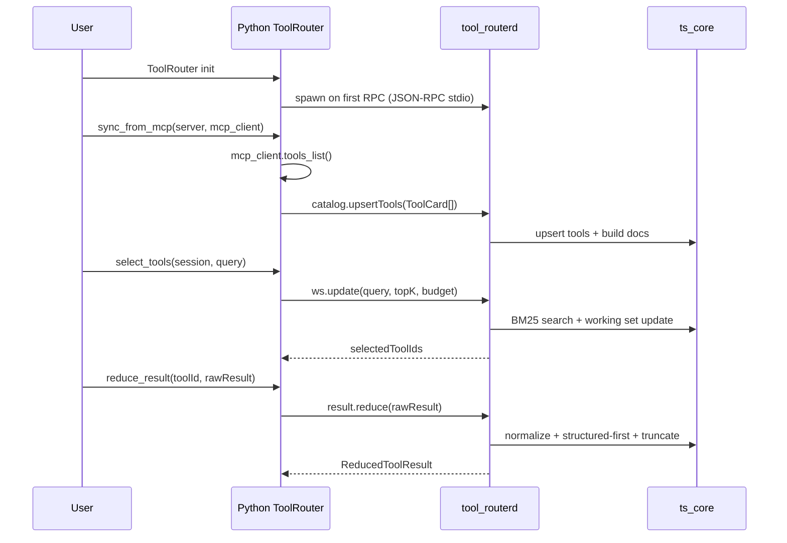

# MCP Tool Router

A TypeScript core + Python wrapper toolkit for routing Model Context Protocol (MCP) tools with
BM25 search, working-set management, and deterministic result reduction.

## Goals

- Fast tool search (BM25) with field weighting and post-score rules
- Tool definition token budgeting within a per-turn budget
- Working-set plug/unplug to stabilize multi-turn tool exposure
- Deterministic tool-result reducers for long/noisy outputs
- MCP-friendly integration: `tools/list` -> index -> expose only needed tools

## Non-goals (initial scope)

- The TS core does not call LLM providers directly
- No embedding or hybrid vector search (BM25 first)
- The TS core does not manage MCP server connections (Python does)

## Minimum MCP tool fields

To keep external MCP integrations low-friction, the router only requires MCP-standard fields:

- `name`
- `description` (optional but recommended)
- `inputSchema` (or `input_schema`)

Everything else is optional. If `tags`/`synonyms`/`examples`/`authHint` are missing,
the Python sync layer derives lightweight `tags` and `synonyms` from `name`/`title`/`description`
so lexical search remains effective.

## Architecture

- **TypeScript core**: catalog, BM25, working set, result policy, safety hints
- **Router daemon**: `tool-routerd` JSON-RPC over stdio (optional HTTP)
- **Python wrapper**: MCP sync, LLM orchestration, daemon lifecycle


## Quickstart

```bash
python examples/quickstart.py
```

Set `ROUTERD` to override the daemon command, for example:

```bash
ROUTERD="tool-routerd" python examples/quickstart.py
```

## Compare against a real MCP server

Provide a real MCP server command and compare naive vs router selection:

```bash
MCP_SERVER_CMD="your-mcp-server --stdio" python examples/compare_mcp.py "summarize the latest report"
```

If your MCP server requires initialization, pass the JSON payload and (optionally) the initialized notification:

```bash
MCP_INIT='{"protocolVersion":"...","capabilities":{}}' MCP_INITIALIZED=1 \
  MCP_SERVER_CMD="your-mcp-server --stdio" python examples/compare_mcp.py "summarize the latest report"
```

## Sequence diagram


## Repository layout

```
packages/
  core/      # BM25, tokenizer, working set, result policy
  daemon/    # tool-routerd JSON-RPC server
  cli/       # catalog build/search/eval tooling
  shared/    # shared types and utilities
python/
  mcp_tool_router/  # Python client wrapper
  pyproject.toml
examples/
```


## License

MIT
